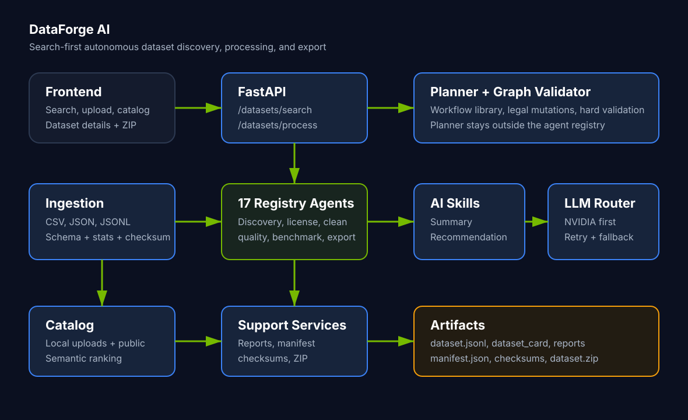

# DataForge AI

**An Autonomous AI Data Engineering Platform.**

Instead of "Where can I find a dataset?" users say **"I need a dataset for my task."**
The platform decides how to get the best dataset. **Generation is the last resort.**

## Hackathon Demo

DataForge is now demoable as an AI-powered dataset discovery platform:

```text
Natural language search -> Ranked dataset results -> AI recommendation
Upload dataset -> Normalize/analyze/index -> Download dataset.zip
```

Best live path:

1. Search `Find datasets for diabetes prediction`.
2. Open a ranked dataset and show the AI summary/recommendation.
3. Upload `demo_datasets/healthcare_diabetes.csv`.
4. Process it, show the quality/schema/artifact output, and download ZIP.
5. Search `diabetes glucose outcome labels` to show the uploaded dataset in the catalog.

See [Demo Runbook](docs/DEMO_RUNBOOK.md) for the 3-minute script, fallback plan, and sample prompts.

## Architecture Diagram



## Core Philosophy

```
Search -> Evaluate -> Curate -> Merge -> Clean -> Translate -> Balance
      -> Generate (only if required) -> Benchmark -> Explain -> Export
```

Every component supports the same philosophy:

> Find existing data if possible. Improve it if needed. Generate only when there is a
> justified gap. Validate everything. Explain every decision.

## Frozen Architecture (Core)

- Search First / Generate Last
- Dynamic Planner (Workflow Library + legal mutations, never free-form graphs)
- Graph Validator (no invalid graph ever executes)
- Agent Registry (single source of truth; capability matrix is derived)
- AI Skill Orchestrator (NVIDIA NIM/OpenAI live providers when keys are configured; deterministic offline fallback otherwise)
- Confidence Protocol (every agent output carries confidence + reason + next_action)
- Hard Gates (License, PII, Critical Toxicity) before any quality score
- Quality Scoring Framework (weighted metrics, see docs/QUALITY_FRAMEWORK.md)
- Explainability Agent (Auditor) -> Decision Trail + Explainability Report
- Dataset Intelligence Report + dataset.zip export

## Repository Structure

```
dataforge-ai/
  backend/        FastAPI app, core protocol, agent registry
  planner/        Workflow library, graph validator, execution engine
  agents/         Independent agents (discovery, curator, generator, ...)
  router/         Provider routing policy prototype
  reports/        Report generators (intelligence, explainability, quality)
  frontend/       Dependency-free dark-mode MVP frontend
  demo_datasets/  Curated CSVs for live demos
  config/         Settings and provider configuration
  tests/          Unit and integration tests
  docs/           PRD, quality framework, demo runbook
```

## Quickstart (backend)

```bash
python -m venv .venv && source .venv/bin/activate
pip install -r requirements.txt
uvicorn backend.app.main:app --reload
```

Windows PowerShell:

```powershell
python -m venv .venv
.\.venv\Scripts\Activate.ps1
pip install -r requirements.txt
uvicorn backend.app.main:app --reload
```

## Quickstart (frontend)

The MVP frontend is dependency-free and lives in `frontend/`.

Start the API:

```powershell
uvicorn backend.app.main:app --reload
```

Start the frontend in a second terminal:

```powershell
cd frontend
python -m http.server 5173
```

Open:

```text
http://127.0.0.1:5173
```

Recommended demo prompts:

- Find datasets for diabetes prediction
- Climate datasets for rainfall forecasting
- Customer churn datasets
- Indian traffic accident datasets

The frontend calls the existing backend APIs:

- `POST /datasets/search`
- `POST /datasets/process`
- `GET /datasets/catalog`
- `GET /ai/llm/status`

## Submission Packaging

For a clean hackathon ZIP, package the source without generated state, caches, or git
history:

```powershell
Compress-Archive -Path backend,agents,planner,reports,router,tests,frontend,docs,demo_datasets,config,README.md,requirements.txt -DestinationPath DataForge_AI_Submission.zip -Force
```

Do not include `.git/`, `.pytest_cache/`, `__pycache__/`, `.pyc`, `tmp/`, `logs/`, or
generated ZIP artifacts.

## Executable Product Slice

The backend now runs a deterministic end-to-end product slice:

```
Request -> RuleBasedPlanner -> Workflow Library -> Graph Validator
        -> Execution Engine -> Registry-backed agents
        -> Search -> License -> Merge -> Clean -> Translate -> Curate
        -> Quality -> Bias -> Validate -> Benchmark -> Reports -> Export
```

The default demo mode is deterministic and offline-safe. It is designed to make
planning, validation, packaging, search, and reporting reproducible without API
keys. Live NVIDIA NIM and OpenAI-compatible calls are available through the AI
Skill Orchestrator when live LLM mode and credentials are configured.

The Planner still never invents workflows. It selects a base Workflow Library entry,
then applies legal mutations such as removing optional translation for single-language
requests or removing optional bias checks for fast profiles. The mutated graph is
validated before execution.

## Dataset Ingestion

DataForge can ingest real dataset content and produce normalized artifacts:

- CSV
- JSON
- JSONL

```bash
curl -X POST http://127.0.0.1:8000/datasets/ingest \
  -H "Content-Type: application/json" \
  -d '{"filename":"healthcare.csv","content":"instruction,language\nTake water,en\nPani piyo,hi\n"}'
```

The response includes a parsed preview, inferred schema, row/column counts, duplicate
and missing-value statistics, a source checksum, and artifact paths under
`tmp/dataforge_runs/ingestions/`:

- `normalized_dataset.jsonl`
- `schema.json`
- `ingestion_report.json`

For the demo path, process an uploaded dataset into reports, manifest, checksums, and
a downloadable ZIP:

```bash
curl -X POST http://127.0.0.1:8000/datasets/process \
  -H "Content-Type: application/json" \
  -d '{"filename":"healthcare.csv","request":"Analyze this uploaded healthcare instruction dataset.","content":"instruction,response,language\nTake water,Hydrate,en\nPani piyo,Hydrate,hi\n"}'
```

This returns an immediate dataset summary plus artifact paths:

```json
{
  "status": "completed",
  "workflow": "uploaded_dataset_package",
  "summary": {
    "rows": 2,
    "columns": 3,
    "missing_values": 0,
    "duplicate_rows": 0,
    "checksum": "..."
  },
  "artifacts": {
    "dataset_zip": "tmp/dataforge_runs/upload-.../dataset.zip",
    "manifest": "tmp/dataforge_runs/upload-.../manifest.json"
  }
}
```

Processed uploads are automatically indexed in the local dataset catalog. Search
uploaded datasets alone:

```bash
curl -X POST http://127.0.0.1:8000/datasets/search \
  -H "Content-Type: application/json" \
  -d '{"query":"glucose bmi diabetes","include_public":false}'
```

Or search uploaded datasets together with public discovery candidates:

```bash
curl -X POST http://127.0.0.1:8000/datasets/search \
  -H "Content-Type: application/json" \
  -d '{"query":"find diabetes prediction datasets","include_public":true,"limit":5}'
```

List the local catalog:

```bash
curl http://127.0.0.1:8000/datasets/catalog
```

Catalog search uses an offline-safe semantic scorer with synonym expansion and the
following ranking shape:

```text
overall_score =
0.50 * semantic relevance
+ 0.20 * quality score
+ 0.15 * completeness
+ 0.10 * source credibility
+ 0.05 * freshness
```

Each indexed upload also receives an AI-generated dataset summary and search
recommendation through a provider-agnostic skill layer:

```text
DatasetSummarySkill -> LLMOrchestrator -> NVIDIA NIM -> OpenAI -> deterministic fallback
```

The skill defines what is needed; the orchestrator owns retries, fallback, and
provider health. By default, `/ai/llm/status` reports `local-deterministic`.
With `DATAFORGE_LIVE_LLM=true` and `NVIDIA_API_KEY`, NVIDIA NIM becomes the
active live provider:

```bash
curl http://127.0.0.1:8000/ai/llm/status
```

Provider priority and retry behavior can be configured:

```powershell
$env:DATAFORGE_LLM_PROVIDERS="nim,gemini,openai,ollama"
$env:DATAFORGE_LIVE_LLM="true"
$env:DATAFORGE_LLM_MAX_RETRIES="3"
$env:DATAFORGE_LLM_COOLDOWN_SECONDS="60"
$env:NVIDIA_API_KEY="<your-nvidia-api-key>"
$env:NVIDIA_NIM_BASE_URL="https://integrate.api.nvidia.com/v1"
$env:NVIDIA_NIM_MODEL="meta/llama-3.1-70b-instruct"
```

Planner output includes machine-readable planning metadata:

```json
{
  "planner_confidence": 0.94,
  "planner_alternatives": ["clean_quality_export", "full_search_improve_export"],
  "planner_mutations": [
    {
      "action": "remove_optional_agent",
      "agent": "translation",
      "reason": "single_language_request"
    }
  ]
}
```

Agent Registry entries also expose dependency metadata (`requires`, `produces`),
category, estimated cost, and estimated runtime. This keeps the current Workflow
Library safe while preparing the Planner for capability/dependency graph building.

## Capability Cards

DataForge exposes machine-readable capability cards for the separate Planner and all
17 registry-backed execution agents:

```bash
curl http://127.0.0.1:8000/agents/cards
```

Each card includes mission, inputs, outputs, required/optional tools, constraints,
success criteria, standardized failure behavior, capability tags, dependencies,
state reads/writes, quality targets, events, cost, runtime, and parallelizability.
The Planner card is included for orchestration documentation but is not a registry
agent.

## Service Manifests

Deterministic support components are described separately from execution agents:

```bash
curl http://127.0.0.1:8000/services/manifests
```

Current service manifests cover report generation, dataset cards, manifests,
checksums, ZIP packaging, templates, and artifact storage. These services are invoked
by agents such as Packaging and Explainability but do not participate in the Agent
Registry. Each service is classified with `service_type`:

- `runtime`: executes during a workflow, such as reports, checksums, manifests, and ZIP packaging.
- `platform`: supports the system itself, such as artifact storage.

Packaging flow:

```text
PackagingAgent -> DatasetCardService -> ReportService -> ChecksumService
               -> ManifestService -> ZipService -> dataset.zip
```

Examples:

- Search-only: `requirement -> discovery -> license -> quality -> validator -> formatter -> packaging -> explainability`
- Cleaning-focused: `discovery -> license -> merge -> cleaning -> curator -> quality -> critic -> validator -> benchmark -> export`
- Multilingual: `cleaning -> curator -> translation -> quality -> bias -> critic -> validator -> export`
- Generation: `generator -> critic -> validator`, with generation used only when a workflow explicitly calls for it.

## Architecture Boundary

DataForge separates orchestration from execution:

- **Planner / Brain:** outside the Agent Registry. It selects Workflow Library entries,
  applies legal mutations, and sends validated graphs to the Execution Engine. It does
  not transform datasets.
- **17 registry-backed execution agents:** requirement analyzer, clarification,
  discovery, license, merge, cleaning, curator, translation, quality evaluator,
  generator, critic, validator, bias, benchmark, formatter, packaging, explainability.
- **Support services:** discovery providers, router, state manager, project store,
  report generators, artifact handling, cache, and provider manager. These are not
  workflow agents.

Start a workflow:

```bash
curl -X POST http://127.0.0.1:8000/workflow/start \
  -H "Content-Type: application/json" \
  -d '{"request":"I need a Hindi-English instruction dataset for healthcare."}'
```

The response includes the selected workflow, confidence-protocol agent messages,
report paths, and the generated `dataset.zip` path under `tmp/dataforge_runs/`.

Additional platform surfaces:

```bash
curl -X POST http://127.0.0.1:8000/projects \
  -H "Content-Type: application/json" \
  -d '{"name":"Healthcare Dataset","quality_profile":"production","target_model":"nemotron"}'
curl http://127.0.0.1:8000/projects
curl http://127.0.0.1:8000/agents/cards
curl http://127.0.0.1:8000/services/manifests
curl -X POST http://127.0.0.1:8000/discovery/search \
  -H "Content-Type: application/json" \
  -d '{"request":"I need an English-Hindi healthcare instruction dataset."}'
curl -X POST http://127.0.0.1:8000/datasets/ingest \
  -H "Content-Type: application/json" \
  -d '{"filename":"healthcare.csv","content":"instruction,language\nTake water,en\nPani piyo,hi\n"}'
curl -X POST http://127.0.0.1:8000/datasets/process \
  -H "Content-Type: application/json" \
  -d '{"filename":"healthcare.csv","request":"Analyze this uploaded healthcare instruction dataset.","content":"instruction,response,language\nTake water,Hydrate,en\nPani piyo,Hydrate,hi\n"}'
curl -X POST http://127.0.0.1:8000/datasets/search \
  -H "Content-Type: application/json" \
  -d '{"query":"healthcare instruction hindi","include_public":true,"limit":5}'
curl http://127.0.0.1:8000/datasets/catalog
curl http://127.0.0.1:8000/ai/llm/status
curl http://127.0.0.1:8000/discovery/providers
curl http://127.0.0.1:8000/workflows
curl http://127.0.0.1:8000/workflow/runs
curl http://127.0.0.1:8000/workflow/status/<task_id>
curl http://127.0.0.1:8000/router/status
curl http://127.0.0.1:8000/reports/<task_id>
curl -O http://127.0.0.1:8000/artifacts/<task_id>/dataset.zip
```

Local development persists project and run metadata in `tmp/dataforge_state.json`.
The repository boundary is isolated so it can be replaced with PostgreSQL without
changing planner, agent, or execution-engine code.

Live discovery is opt-in:

```powershell
$env:DATAFORGE_LIVE_DISCOVERY="true"
$env:GITHUB_TOKEN="<optional-token>"
$env:DATAFORGE_WEB_SEARCH_ENDPOINT="<optional-json-search-endpoint>"
```

When live discovery is disabled or a provider fails, DataForge keeps returning ranked
offline candidates from the local provider catalog.

## Documentation

- [Master PRD](docs/PRD.md) - Vision / Hackathon MVP / Demo Scope
- [Quality Scoring Framework](docs/QUALITY_FRAMEWORK.md) - the heart of the system

## Status

Architecture: **FROZEN**. All future ideas are roadmap items unless required for the demo.
