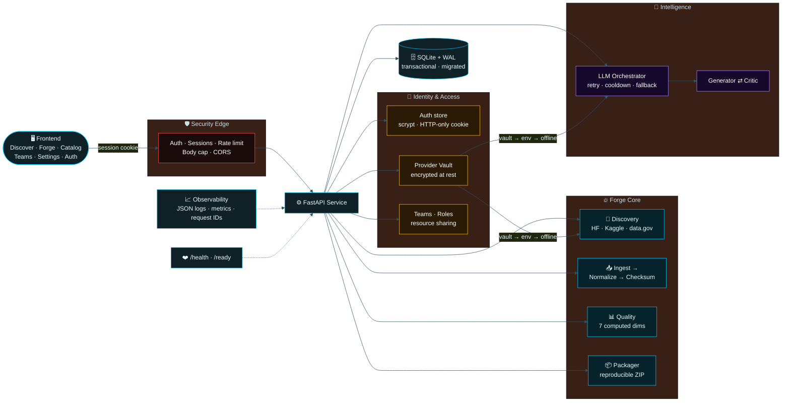

<!-- ════════════════════════════════════════════════════════════════════════ -->
<!--                            D A T A F O R G E                              -->
<!-- ════════════════════════════════════════════════════════════════════════ -->

<div align="center">

<a href="#">
  
</a>

<br/>

<!-- ░░ Typing animation ░░ -->
<a href="#">
  
</a>

<br/><br/>

<!-- ░░ Neon badge stack ░░ -->
<p>
  
  
  
  
  
</p>
<p>
  
  
  
  
  
  
  
</p>

<br/>

<!-- ░░ Quick nav ░░ -->
<sub>
  <a href="#-why-dataforge"><b>WHY</b></a> &nbsp;•&nbsp;
  <a href="#-architecture"><b>ARCHITECTURE</b></a> &nbsp;•&nbsp;
  <a href="#-quickstart"><b>QUICKSTART</b></a> &nbsp;•&nbsp;
  <a href="#-the-pipeline"><b>PIPELINE</b></a> &nbsp;•&nbsp;
  <a href="#-identity--access"><b>IDENTITY</b></a> &nbsp;•&nbsp;
  <a href="#-api"><b>API</b></a> &nbsp;•&nbsp;
  <a href="#-production-hardening"><b>HARDENING</b></a> &nbsp;•&nbsp;
  <a href="#-status"><b>STATUS</b></a>
</sub>

</div>

<br/>

---

## ◆ Why DataForge

> **The gap between a dataset that *exists* and a dataset an *AI can actually use* is enormous.**
> DataForge closes it — automatically.

Most “data tools” stop at storage. DataForge runs the full forge: it **discovers** real datasets from public catalogs, **ingests** and **normalizes** them deterministically, **scores** them across seven quality dimensions computed from the actual rows, lets paired **generator / critic agents** improve them with a real model, and **packages** the result into a checksummed, reproducible ZIP — all behind a hardened, observable API with **real accounts, an encrypted credential vault, and team-based access control**.

<table>
<tr>
<td width="33%" valign="top">

### ⚡ Deterministic core
Ingest → normalize → checksum → package. Byte-reproducible. No hidden state. Fully tested.

</td>
<td width="33%" valign="top">

### 🧠 Real intelligence
Live model path with retries, circuit-breaker cooldown, and a labeled deterministic fallback — never silent.

</td>
<td width="33%" valign="top">

### 🔐 Accounts & teams
HTTP-only sessions, per-user ownership, an encrypted provider vault, and teams with roles + resource sharing.

</td>
</tr>
</table>

---

## ◆ Architecture



---

## ◆ Quickstart

```bash
# 1 ─ Clone
git clone https://github.com/<you>/Data-Forge.git && cd Data-Forge

# 2 ─ Configure (never commit real secrets)
cp .env.example .env

#    Generate a vault master key (required for Settings / provider vault)
python -c "import secrets; print('DATAFORGE_VAULT_KEY=' + secrets.token_urlsafe(48))" >> .env

# 3 ─ Run with Docker (recommended)
docker compose -f deploy/docker-compose.yml up --build

#    …or run locally
pip install -r requirements.txt
uvicorn backend.app.main:app --host 0.0.0.0 --port 8000

# 4 ─ Verify it's alive
curl -s localhost:8000/health   | jq
curl -s localhost:8000/ready    | jq

# 5 ─ Open the app, then register an account
#    Discover · Forge · Catalog · Teams · Settings  (protected pages redirect to /auth)
```

<details>
<summary><b>🔑 Environment flags (click to expand)</b></summary>

<br/>

| Variable | Default | Purpose |
|---|---|---|
| `DATAFORGE_PERSISTENCE` | `sqlite` | `sqlite` (WAL, prod) or `json` (dev only) |
| `DATAFORGE_DB_PATH` | `/data/dataforge.db` | SQLite location |
| `DATAFORGE_API_KEYS` | *(empty = open)* | Comma-separated keys; empty disables service-key auth |
| `DATAFORGE_MAX_BODY_BYTES` | `10485760` | Request body cap → `413` over limit |
| `DATAFORGE_RATE_CAPACITY` / `_REFILL` | `60` / `1.0` | Token-bucket rate limiting |
| `DATAFORGE_CORS_ORIGINS` | `http://localhost:5173` | Allowed origins |
| `DATAFORGE_LIVE_LLM` | `false` | Flip on to use the real model endpoint |
| `DATAFORGE_LLM_MODEL` | `meta/llama-3.1-8b-instruct` | Live model |
| `DATAFORGE_DISCOVERY_LIVE` | `false` | Flip on for real provider calls (else empty, **never fabricated**) |
| **`DATAFORGE_VAULT_KEY`** | *(required for vault)* | Master key encrypting provider creds at rest (≥ 16 bytes) |
| **`DATAFORGE_VAULT_DB`** | `tmp/dataforge_vault.db` | Encrypted provider-credential store |
| **`DATAFORGE_TEAMS_DB`** | `tmp/dataforge_teams.db` | Teams / members / shares store |
| **`DATAFORGE_SESSION_COOKIE`** | `dataforge_session` | HTTP-only session cookie name (SameSite=Lax) |

</details>

---

## ◆ The Pipeline

```text
   ┌──────────┐   ┌──────────┐   ┌───────────┐   ┌──────────┐   ┌──────────┐
   │ DISCOVER │ → │  INGEST  │ → │ NORMALIZE │ → │  SCORE   │ → │ PACKAGE  │
   └──────────┘   └──────────┘   └───────────┘   └──────────┘   └──────────┘
   real catalog    schema infer    canonical       7 computed     checksummed
   APIs, gated     + validation    form + dedupe    dimensions     reproducible ZIP
```

| Stage | What actually happens | Honesty guarantee |
|:--|:--|:--|
| **Discover** | Queries HuggingFace Hub, Kaggle, data.gov with auth + pagination | Returns **empty**, never invented, when live discovery is off |
| **Ingest / Normalize** | Deterministic parse → canonical schema → dedupe | Byte-reproducible; covered by tests |
| **Score** | 7 quality dimensions computed **from the rows** | No hardcoded constants; scores move with the data |
| **Agents** | Generator drafts, Critic reviews — both call the model | Provider is **labeled** (`live-http` vs `local-deterministic`) |
| **Package** | Checksummed, reproducible `dataset.zip` artifact | Verifiable hash; retrievable by `task_id` |

---

## ◆ Identity & Access

> Every forge action runs as a **real authenticated user**. Credentials are encrypted, ownership is enforced, and collaboration happens through **teams** — not shared logins.

<table>
<tr><th align="left">Layer</th><th align="left">What ships</th></tr>
<tr><td><b>🔑 Auth & sessions</b></td><td>Register / login / logout with <code>scrypt</code> password hashing (N=16384). Sessions ride an <b>HTTP-only, SameSite=Lax cookie</b> — no tokens in <code>localStorage</code>. <code>GET /auth/me</code> resolves the current user or <code>401</code>.</td></tr>
<tr><td><b>👤 Per-user ownership</b></td><td>Datasets, projects, and runs are owned by their creator. Queries are ownership-scoped; cross-user access is denied unless explicitly shared.</td></tr>
<tr><td><b>🔐 Provider vault</b></td><td>Provider API keys (HF, Kaggle, …) are <b>encrypted at rest</b> under <code>DATAFORGE_VAULT_KEY</code>. Keys are <b>never returned to the browser</b> and <b>never stored per-team</b> — they stay strictly per-user. Resolution order is <b>vault → env → offline</b>, and the active source is always labeled.</td></tr>
<tr><td><b>👥 Teams & roles</b></td><td>Roles escalate <code>viewer → member → admin → owner</code>. Owners/admins (and global admins) manage membership and roles. The owner row is protected from demotion/removal.</td></tr>
<tr><td><b>🔗 Resource sharing</b></td><td>Share a <code>dataset</code>, <code>project</code>, or <code>run</code> with a team at <code>view</code> or <code>edit</code> permission. The vault is <b>intentionally not a shareable resource type</b>.</td></tr>
</table>

**Roles × capability**

| Capability | viewer | member | admin | owner |
|:--|:--:|:--:|:--:|:--:|
| See shared team resources | ✅ | ✅ | ✅ | ✅ |
| Edit `edit`-shared resources | — | ✅ | ✅ | ✅ |
| Add / remove members · change roles | — | — | ✅ | ✅ |
| Share / revoke resources | — | — | ✅ | ✅ |
| Delete team | — | — | — | ✅ |

---

## ◆ API

<table>
<tr><th align="left">Method · Route</th><th align="left">Description</th></tr>
<tr><td colspan="2"><sub><b>— IDENTITY —</b></sub></td></tr>
<tr><td><code>POST&nbsp;/auth/register</code></td><td>Create an account → <code>201</code></td></tr>
<tr><td><code>POST&nbsp;/auth/login</code></td><td>Authenticate → <code>200</code> + HTTP-only session cookie</td></tr>
<tr><td><code>POST&nbsp;/auth/logout</code></td><td>Clear the session</td></tr>
<tr><td><code>GET&nbsp;&nbsp;/auth/me</code></td><td>Current user, or <code>401</code></td></tr>
<tr><td><code>GET&nbsp;&nbsp;/settings/providers</code></td><td>List configured provider slots (never returns secrets)</td></tr>
<tr><td><code>POST&nbsp;/settings/providers/{provider}</code></td><td>Store / update an encrypted provider credential</td></tr>
<tr><td><code>DELETE&nbsp;/settings/providers/{provider}</code></td><td>Remove a stored credential</td></tr>
<tr><td colspan="2"><sub><b>— TEAMS & SHARING —</b></sub></td></tr>
<tr><td><code>GET&nbsp;&nbsp;/teams</code> · <code>POST&nbsp;/teams</code></td><td>List / create teams</td></tr>
<tr><td><code>DELETE&nbsp;/teams/{id}</code></td><td>Delete a team (owner / global admin)</td></tr>
<tr><td><code>GET&nbsp;&nbsp;/teams/{id}/members</code> · <code>POST</code></td><td>List members · add member / change role</td></tr>
<tr><td><code>DELETE&nbsp;/teams/{id}/members/{user_id}</code></td><td>Remove a member</td></tr>
<tr><td><code>GET&nbsp;&nbsp;/teams/{id}/shares</code></td><td>List resources shared with the team</td></tr>
<tr><td><code>POST&nbsp;/teams/{id}/shares</code> · <code>DELETE</code></td><td>Share / revoke a <code>dataset</code> · <code>project</code> · <code>run</code></td></tr>
<tr><td colspan="2"><sub><b>— FORGE —</b></sub></td></tr>
<tr><td><code>POST&nbsp;/datasets/search</code></td><td>Search the local catalog</td></tr>
<tr><td><code>POST&nbsp;/datasets/process</code></td><td>Ingest → normalize → score → package</td></tr>
<tr><td><code>GET&nbsp;&nbsp;/datasets/catalog</code></td><td>Browse processed datasets (paginated)</td></tr>
<tr><td><code>POST&nbsp;/datasets/ingest</code></td><td>Bring raw data into the forge</td></tr>
<tr><td><code>GET&nbsp;&nbsp;/discovery/search</code></td><td>Real provider-gated dataset discovery (with intensity)</td></tr>
<tr><td><code>POST&nbsp;/workflow/start</code></td><td>Kick off the generator ⇄ critic agent loop</td></tr>
<tr><td><code>GET&nbsp;&nbsp;/ai/llm/status</code> · <code>/router/status</code></td><td>Live model + routing health</td></tr>
<tr><td><code>GET&nbsp;&nbsp;/artifacts/{task_id}/dataset.zip</code></td><td>Download the packaged artifact</td></tr>
<tr><td><code>GET&nbsp;&nbsp;/health</code> · <code>/ready</code></td><td>Liveness &amp; dependency-checked readiness</td></tr>
</table>

---

## ◆ Production Hardening

<div align="center">

| Domain | Status | What ships |
|:--|:--:|:--|
| Authentication | 🟢 | scrypt hashing, HTTP-only SameSite session cookies, `/auth/me` guard |
| Credential vault | 🟢 | Provider keys encrypted at rest; vault → env → offline resolution; secrets never sent to client |
| Access control | 🟢 | Per-user ownership + teams/roles + `view`/`edit` resource sharing; owner protection |
| Persistence | 🟢 | SQLite + WAL, `BEGIN IMMEDIATE`, idempotent migrations, concurrency tests |
| API security | 🟢 | Service-key auth, token-bucket rate limit, body cap (`413`), env CORS |
| LLM path | 🟢 | Timeouts, bounded retry/backoff, circuit-breaker cooldown, labeled fallback |
| Quality metrics | 🟢 | All 7 dimensions computed from data + variance tests |
| Discovery | 🟢 | Real provider APIs, clean URLs, **zero fabrication** by default |
| Agents | 🟢 | Generator/Critic invoke the model; only real agents exposed |
| Observability | 🟢 | Structured JSON logs, request IDs, metrics incl. provider fallback rate |
| Frontend | 🟢 | Env-driven API base, auth-gated pages, retry/error/empty states |
| CI/CD | 🟢 | Lint → compile → test → Docker build; `/health` + `/ready` gating |

</div>

---

## ◆ Project Structure

```text
Data-Forge/
├── backend/
│   ├── app/          # security · sessions · observability · health · routes · main
│   ├── auth/         # auth store · teams · roles · access control (RBAC)
│   ├── vault/        # encrypted provider-credential vault (SecretBox)
│   ├── core/         # repository (SQLite + WAL, migrations)
│   └── services/     # discovery · credentials · llm_provider · quality · agents
├── frontend/         # index · forge · catalog · teams · settings · auth
│                     # config.js · api-client.js · app.js · styles.css
├── deploy/           # Dockerfile · docker-compose.yml
├── tests/            # 187 unittest / 241 pytest-collected · contract mocks
├── .github/workflows # CI: lint · compile · test · docker build
├── requirements.txt
└── .env.example
```

---

## ◆ Testing

```bash
python -m pytest -q                    # → passing
python -m unittest discover tests -v   # → 187 ran, OK
python -m pytest --collect-only -q     # → 241 collected
python -m compileall backend agents planner reports router tests
```

<div align="center">


</div>

---

## ◆ Status

> **Readiness ≈ 95%.** The full product spine — forge core → auth → vault → live-wiring → teams/RBAC → team-management UI — is implemented and green.

**✅ Done** — persistence · security · computed quality · observability · agents · CI/CD · frontend robustness · packaging · **authentication · per-user ownership · encrypted vault · vault→env→offline resolution · teams + roles + sharing · Teams UI**.

**⏳ Final external gates** (cannot run offline, by design):
- Live-staging smoke against the **real model endpoint**
- Live-staging smoke against **real discovery providers** (HF / Kaggle / data.gov)
- **Docker image build** in CI
- **Kluster review**
- Production **deployment**

> DataForge is honest by construction: anything that needs the live world is **feature-flagged and labeled**, so the offline default never pretends to be something it isn't. Secrets stay encrypted and per-user; collaboration flows through teams, never shared logins.

---

<div align="center">


<sub>Forged with precision · MIT Licensed · <b>DataForge</b></sub>

</div>
