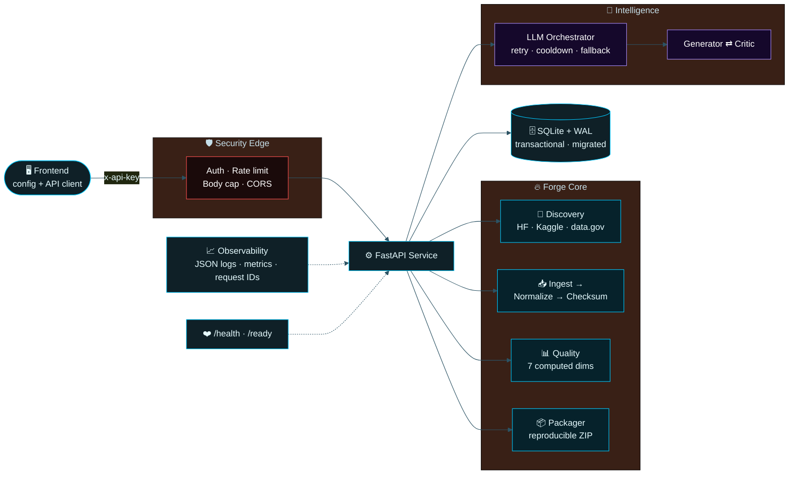

<!-- ════════════════════════════════════════════════════════════════════════ -->
<!--                            D A T A F O R G E                              -->
<!-- ════════════════════════════════════════════════════════════════════════ -->

<div align="center">

<a href="#">
  
</a>

<br/>

<!-- ░░ Typing animation ░░ -->
<a href="#">
  
</a>

<br/><br/>

<!-- ░░ Neon badge stack ░░ -->
<p>
  
  
  
  
  
</p>
<p>
  
  
  
  
  
</p>

<br/>

<!-- ░░ Quick nav ░░ -->
<sub>
  <a href="#-why-dataforge"><b>WHY</b></a> &nbsp;•&nbsp;
  <a href="#-architecture"><b>ARCHITECTURE</b></a> &nbsp;•&nbsp;
  <a href="#-quickstart"><b>QUICKSTART</b></a> &nbsp;•&nbsp;
  <a href="#-the-pipeline"><b>PIPELINE</b></a> &nbsp;•&nbsp;
  <a href="#-api"><b>API</b></a> &nbsp;•&nbsp;
  <a href="#-production-hardening"><b>HARDENING</b></a> &nbsp;•&nbsp;
  <a href="#-status"><b>STATUS</b></a>
</sub>

</div>

<br/>

---

## ◆ Why DataForge

> **The gap between a dataset that *exists* and a dataset an *AI can actually use* is enormous.**
> DataForge closes it — automatically.

Most “data tools” stop at storage. DataForge runs the full forge: it **discovers** real datasets from public catalogs, **ingests** and **normalizes** them deterministically, **scores** them across seven quality dimensions computed from the actual rows, lets paired **generator / critic agents** improve them with a real model, and **packages** the result into a checksummed, reproducible ZIP — all behind a hardened, observable API.

<table>
<tr>
<td width="33%" valign="top">

### ⚡ Deterministic core
Ingest → normalize → checksum → package. Byte-reproducible. No hidden state. Fully tested.

</td>
<td width="33%" valign="top">

### 🧠 Real intelligence
Live model path with retries, circuit-breaker cooldown, and a labeled deterministic fallback — never silent.

</td>
<td width="33%" valign="top">

### 🛡️ Built for prod
Auth, rate limits, body caps, CORS, structured logs, metrics, health probes, Docker, CI.

</td>
</tr>
</table>

---

## ◆ Architecture



---

## ◆ Quickstart

```bash
# 1 ─ Clone
git clone https://github.com/<you>/Data-Forge.git && cd Data-Forge

# 2 ─ Configure (never commit real secrets)
cp .env.example .env

# 3 ─ Run with Docker (recommended)
docker compose -f deploy/docker-compose.yml up --build

#    …or run locally
pip install -r requirements.txt
uvicorn backend.app.main:app --host 0.0.0.0 --port 8000

# 4 ─ Verify it's alive
curl -s localhost:8000/health   | jq
curl -s localhost:8000/ready    | jq
```

<details>
<summary><b>🔑 Environment flags (click to expand)</b></summary>

<br/>

| Variable | Default | Purpose |
|---|---|---|
| `DATAFORGE_PERSISTENCE` | `sqlite` | `sqlite` (WAL, prod) or `json` (dev only) |
| `DATAFORGE_DB_PATH` | `/data/dataforge.db` | SQLite location |
| `DATAFORGE_API_KEYS` | *(empty = open)* | Comma-separated keys; empty disables auth |
| `DATAFORGE_MAX_BODY_BYTES` | `10485760` | Request body cap → `413` over limit |
| `DATAFORGE_RATE_CAPACITY` / `_REFILL` | `60` / `1.0` | Token-bucket rate limiting |
| `DATAFORGE_CORS_ORIGINS` | `http://localhost:5173` | Allowed origins |
| `DATAFORGE_LIVE_LLM` | `false` | Flip on to use the real model endpoint |
| `DATAFORGE_LLM_MODEL` | `meta/llama-3.1-8b-instruct` | Live model |
| `DATAFORGE_DISCOVERY_LIVE` | `false` | Flip on for real provider calls (else empty, **never fabricated**) |

</details>

---

## ◆ The Pipeline

```text
   ┌──────────┐   ┌──────────┐   ┌───────────┐   ┌──────────┐   ┌──────────┐
   │ DISCOVER │ → │  INGEST  │ → │ NORMALIZE │ → │  SCORE   │ → │ PACKAGE  │
   └──────────┘   └──────────┘   └───────────┘   └──────────┘   └──────────┘
   real catalog    schema infer    canonical       7 computed     checksummed
   APIs, gated     + validation    form + dedupe    dimensions     reproducible ZIP
```

| Stage | What actually happens | Honesty guarantee |
|:--|:--|:--|
| **Discover** | Queries HuggingFace Hub, Kaggle, data.gov with auth + pagination | Returns **empty**, never invented, when live discovery is off |
| **Ingest / Normalize** | Deterministic parse → canonical schema → dedupe | Byte-reproducible; covered by tests |
| **Score** | 7 quality dimensions computed **from the rows** | No hardcoded constants; scores move with the data |
| **Agents** | Generator drafts, Critic reviews — both call the model | Provider is **labeled** (`live-http` vs `local-deterministic`) |
| **Package** | Checksummed, reproducible `dataset.zip` artifact | Verifiable hash; retrievable by `task_id` |

---

## ◆ API

<table>
<tr><th align="left">Method · Route</th><th align="left">Description</th></tr>
<tr><td><code>POST&nbsp;/datasets/search</code></td><td>Search the local catalog with optional public discovery + intensity</td></tr>
<tr><td><code>POST&nbsp;/datasets/process</code></td><td>Ingest → normalize → score → package</td></tr>
<tr><td><code>GET&nbsp;&nbsp;/datasets/catalog</code></td><td>Browse processed datasets (paginated)</td></tr>
<tr><td><code>POST&nbsp;/datasets/ingest</code></td><td>Bring raw data into the forge</td></tr>
<tr><td><code>GET&nbsp;&nbsp;/discovery/search</code></td><td>Real provider-gated dataset discovery with Easy/Medium/Hard/Very Hard/Intense effort</td></tr>
<tr><td><code>POST&nbsp;/workflow/start</code></td><td>Kick off the generator ⇄ critic agent loop</td></tr>
<tr><td><code>GET&nbsp;&nbsp;/ai/llm/status</code> · <code>/router/status</code></td><td>Live model + routing health</td></tr>
<tr><td><code>GET&nbsp;&nbsp;/artifacts/{task_id}/dataset.zip</code></td><td>Download the packaged artifact</td></tr>
<tr><td><code>GET&nbsp;&nbsp;/health</code> · <code>/ready</code></td><td>Liveness &amp; dependency-checked readiness</td></tr>
</table>

---

## ◆ Production Hardening

<div align="center">

| Domain | Status | What ships |
|:--|:--:|:--|
| Persistence | 🟢 | SQLite + WAL, `BEGIN IMMEDIATE`, idempotent migrations, concurrency tests |
| API security | 🟢 | API-key auth, token-bucket rate limit, body cap (`413`), env CORS |
| LLM path | 🟢 | Timeouts, bounded retry/backoff, circuit-breaker cooldown, labeled fallback |
| Quality metrics | 🟢 | All 7 dimensions computed from data + variance tests |
| Discovery | 🟢 | Real provider APIs, clean URLs, **zero fabrication** by default |
| Agents | 🟢 | Generator/Critic invoke the model; only real agents exposed |
| Observability | 🟢 | Structured JSON logs, request IDs, metrics incl. provider fallback rate |
| Frontend | 🟢 | Three-page Discover / Forge / Catalog UI with env-driven API base, retry/error/empty states |
| CI/CD | 🟢 | Lint → compile → test → Docker build; `/health` + `/ready` gating |

</div>

---

## ◆ Project Structure

```text
Data-Forge/
├── backend/
│   ├── app/          # security · observability · health · pagination · main
│   ├── core/         # repository (SQLite + WAL, migrations)
│   └── services/     # discovery · llm_provider · quality · agents
├── frontend/         # Discover / Forge / Catalog static UI + API client
├── deploy/           # Dockerfile · docker-compose.yml
├── tests/            # 139 tests · stdlib unittest + contract mocks
├── .github/workflows # CI: lint · compile · test · docker build
├── requirements.txt
└── .env.example
```

---

## ◆ Testing

```bash
python -m unittest discover tests -v  # -> 95 passed in this checkout
python -m compileall backend tests
```

<div align="center">


</div>

---

## ◆ Status

> **Readiness ≈ 90%.** Production backlog merged; deterministic + contract suites green.

**✅ Done** — persistence · security · computed quality · observability · agents · CI/CD · frontend robustness · packaging.

**⏳ Final external gates** (cannot run offline, by design):
- Live-staging smoke against the **real model endpoint**
- Live-staging smoke against **real discovery providers** (HF / Kaggle / data.gov)
- **Docker image build** in CI
- **Kluster review**

> DataForge is honest by construction: anything that needs the live world is **feature-flagged and labeled**, so the offline default never pretends to be something it isn't.

---

<div align="center">


<sub>Forged with precision · MIT Licensed · <b>DataForge</b></sub>

</div>
